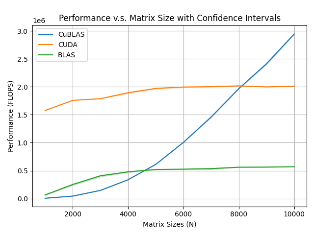
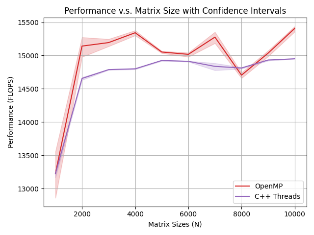
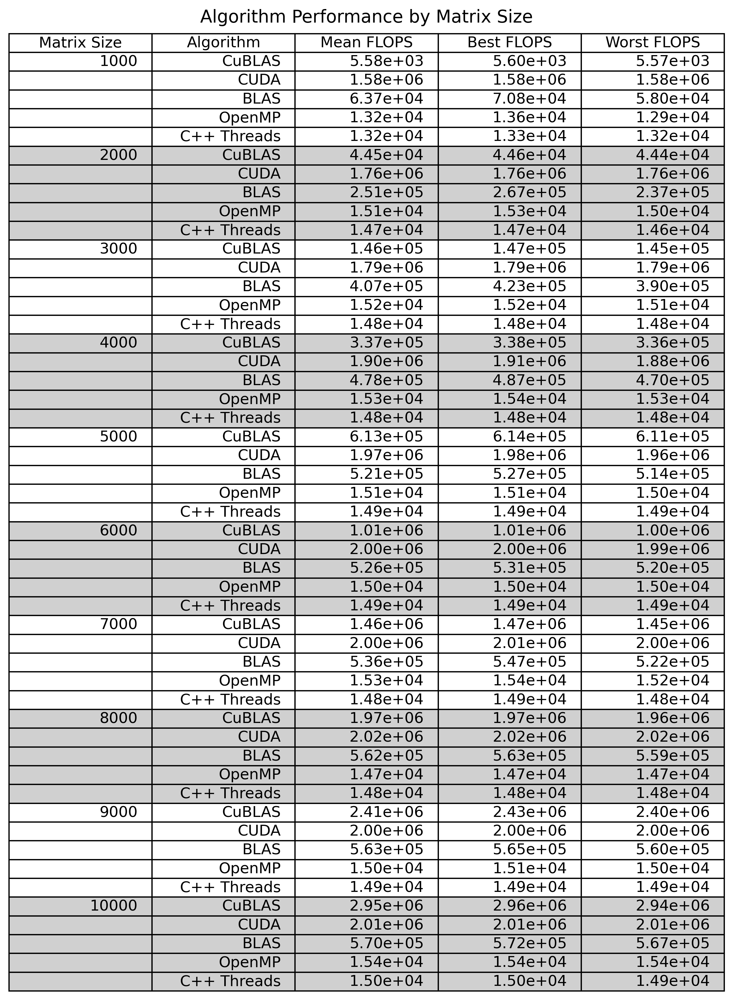

# General Matrix Multiplication (GEMM)

[](https://doi.org/10.5281/zenodo.17299738)

## Installation

```bash
# Descargar OpenBlas
wget https://github.com/OpenMathLib/OpenBLAS/archive/refs/tags/v0.3.29.tar.gz
tar -xvzf v0.3.29.tar.gz
cd OpenBLAS-0.3.29

# Instalar
make -j$(nproc) USE_OPENMP=1
make PREFIX=~/openblas install
```

## Compila y ejecuta

```bash
./compile.sh <matrix-size>
./main
./mainCuda
```

## Compilar y ejecutar todos los test

```bash
./execute.sh
```

## Sample Results

Plotted are sample means with confidence intervals of FLOPS that were calculated from 30 runtimes for each algorithm and matrix size pair and resampled 10,000 times with replacement using bootstrapping.






