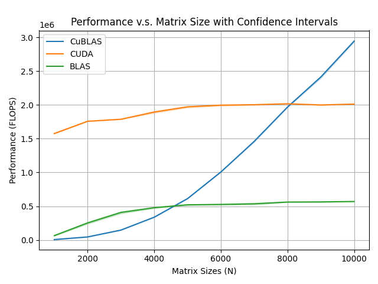
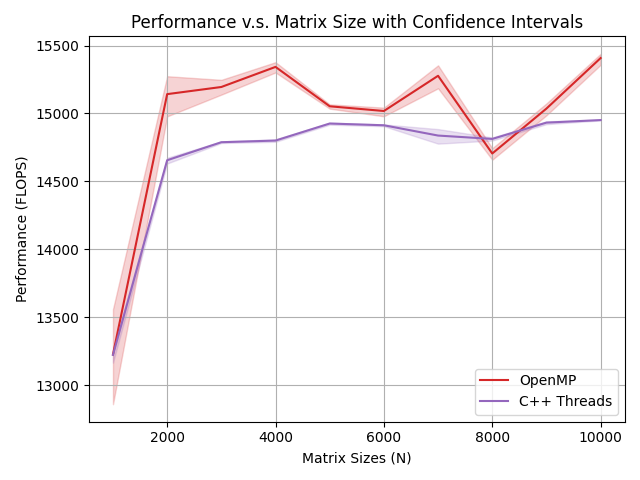
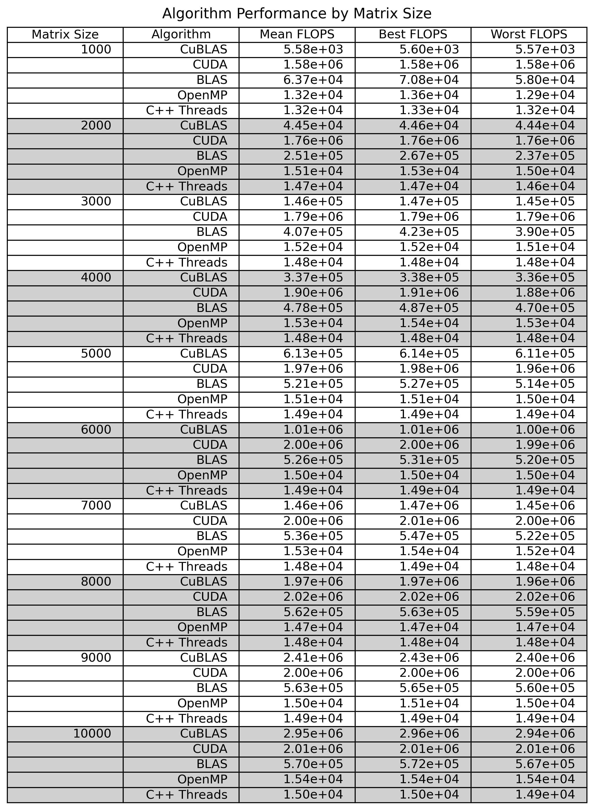

# General Matrix Multiplication (GEMM)

[](https://doi.org/10.5281/zenodo.17299738)

Implementation and performance evaluation of general matrix multiplication (GEMM) on CPU and GPU.

## Installation

```bash
# Download OpenBLAS
wget https://github.com/OpenMathLib/OpenBLAS/archive/refs/tags/v0.3.29.tar.gz
tar -xvzf v0.3.29.tar.gz
cd OpenBLAS-0.3.29

# Build and install
make -j$(nproc) USE_OPENMP=1
make PREFIX=~/openblas install
```

## Build and Run

Build the project for a specific matrix size:

```bash
./compile.sh <tamano_matriz>
```

Run the CPU version:

```bash
./main
```

Run the GPU version (CUDA):

```bash
./mainCuda
```

## Run All Tests

```bash
./execute.sh
```

## Performance Evaluation

Run the full test suite:

```bash
# Evaluate all matrix sizes (64, 128, 256, 512, 1024)
python evaluar_gemm.py --reps 30

# CPU-only evaluation
python evaluar_gemm.py --reps 30 --out evaluacion_cpu.csv
```

### Metrics Obtained

- Average execution time
- GFLOPs
- Maximum RAM usage
- Maximum VRAM usage
- Average GPU utilization

## Example Results

The following charts were generated with `evaluar_gemm.py`. The results correspond to 30 runs per matrix size and show the average performance (GFLOPs) together with 95% confidence intervals estimated using *bootstrapping*.

### GPU Performance



### CPU Performance



### Detailed Results


